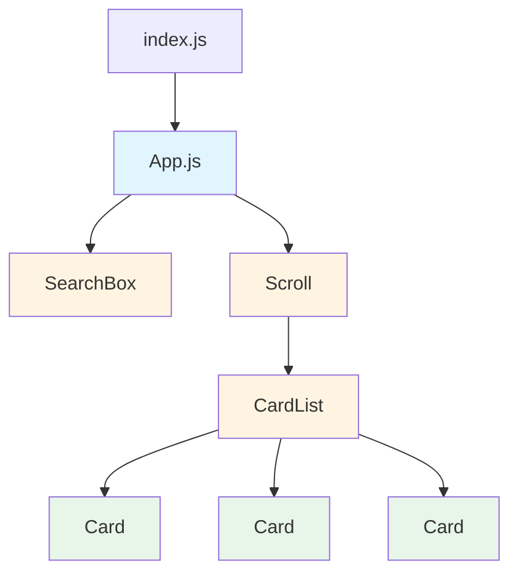
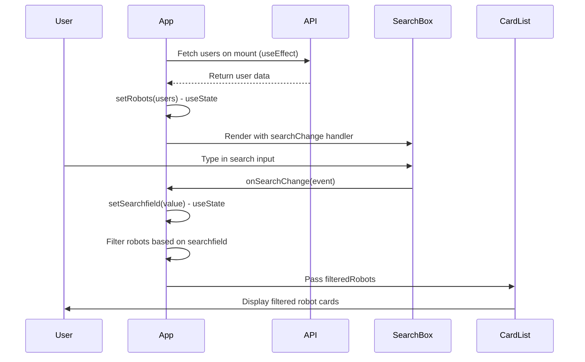

# RoboFriends

A React tutorial application that displays a searchable list of robot friends. Demonstrates React Hooks (`useState` and `useEffect`) for managing component state and handling side effects.

## Overview

RoboFriends fetches user data from an API and displays it as robot cards. Users can search robots by name, and the list updates in real time based on search input.

## Features

- Real-time search functionality
- Dynamic robot card generation with unique avatars
- Fetches data from JSONPlaceholder API
- Built with React Hooks for state management
- Styled with Tachyons CSS framework

## Getting started

### Prerequisites

- Node.js v14 or higher
- npm or yarn

### Installation

1.  Clone this repository:

    ```bash
    git clone <repository-url>
    cd rebofriends
    ```

2.  Install dependencies:

    ```bash
    npm install
    ```

3.  Start the development server:

    ```bash
    npm start
    ```

4.  Open [http://localhost:3000](http://localhost:3000) in your browser.

## Project structure

```txt
rebofriends/
├── public/
│   ├── index.html
│   └── manifest.json
├── src/
│   ├── components/
│   │   ├── Card.js          # Individual robot card component
│   │   ├── CardList.js      # Container for robot cards
│   │   ├── SearchBox.js     # Search input component
│   │   └── Scroll.js        # Scrollable container wrapper
│   ├── containers/
│   │   ├── App.js           # Main application component
│   │   └── App.css          # Application styles
│   ├── index.js             # Application entry point
│   └── index.css            # Global styles
└── package.json
```

## Component architecture



## React Hooks

This project uses two React Hooks: `useState` and `useEffect`.

### useState Hook

The `useState` Hook manages component state. This application uses it to track three state variables:

```javascript
const [robots, setRobots] = useState([]);        // Stores the list of robots from API
const [searchfield, setSearchfield] = useState('');  // Stores the search input value
const [count, setCount] = useState(0);           // Demo counter (for demonstration)
```

**How it works:**

1. `useState` returns an array with two elements: the current state value and a function to update it.
2. When you update state using the setter function (for example, `setRobots`), React re-renders the component.
3. The search functionality uses `setSearchfield` to update the search term as the user types.
4. The filtered robots list is computed based on the `searchfield` state.

### useEffect Hook

The `useEffect` Hook handles side effects in the component, such as API calls, subscriptions, or DOM manipulation.

```javascript
useEffect(() => {
  fetch('https://jsonplaceholder.typicode.com/users')
    .then(response => response.json())
    .then(users => {setRobots(users)});
}, []); // Empty dependency array means this runs once on mount
```

**How it works:**

1. `useEffect` takes two arguments: a function containing the side effect, and a dependency array.
2. The empty dependency array `[]` means the effect runs only once when the component mounts.
3. In this case, it fetches robot data from the API and updates the `robots` state.
4. If you add dependencies (for example, `[count]`), the effect re-runs whenever those dependencies change.

## Data flow



## State management flow

```mermaid
graph LR
    A[Initial State] --> B[useEffect runs on mount]
    B --> C[Fetch API data]
    C --> D[setRobots updates state]
    D --> E[Component re-renders]
    E --> F[User types in SearchBox]
    F --> G[onSearchChange called]
    G --> H[setSearchfield updates state]
    H --> I[Component re-renders]
    I --> J[Filter robots array]
    J --> K[Display filtered results]
    
    style D fill:#ffebee
    style H fill:#ffebee
    style E fill:#e8f5e9
    style I fill:#e8f5e9
```



## Components

### App.js

The main container component that:

- Manages all state using React Hooks
- Handles data fetching and filtering logic
- Renders child components and passes props

### SearchBox.js

A controlled input component that:

- Receives `searchChange` callback as prop
- Triggers parent state update on input change

### CardList.js

A component that:

- Receives filtered robots array as prop
- Maps over robots and renders individual `Card` components
- Uses array index as key (note: in production, use unique IDs)

### Card.js

A presentational component that:

- Displays robot avatar, name, and email
- Uses RoboHash API for generating robot images

### Scroll.js

A wrapper component that:

- Provides a scrollable container
- Uses `props.children` to render nested content

## API integration

The application fetches user data from [JSONPlaceholder](https://jsonplaceholder.typicode.com/users), a fake REST API for testing and prototyping. Robot avatars are generated using [RoboHash](https://robohash.org/), which creates unique robot images based on user IDs.

## Technologies

- **React** (v19.1.1): UI library
- **React Hooks**: Modern state management
- **Tachyons**: Functional CSS framework
- **JSONPlaceholder API**: Fake REST API
- **RoboHash API**: Robot avatar generation

## Learning points

This project demonstrates:

1.  **Functional components**: Modern React using function components instead of class components
2.  **React Hooks**: Using `useState` for state management and `useEffect` for side effects
3.  **Controlled components**: Search input is controlled by React state
4.  **Component composition**: Breaking UI into smaller, reusable components
5.  **Props and callbacks**: Passing data down and events up through component hierarchy
6.  **Conditional rendering**: Showing loading state when data is not yet available

## Notes

- The `count` state variable in `App.js` is included for demonstration purposes to show how `useEffect` dependencies work.
- If you add `count` to the `useEffect` dependency array, the API call re-runs every time the button is clicked.
- The search is case-insensitive and filters robots by name.
